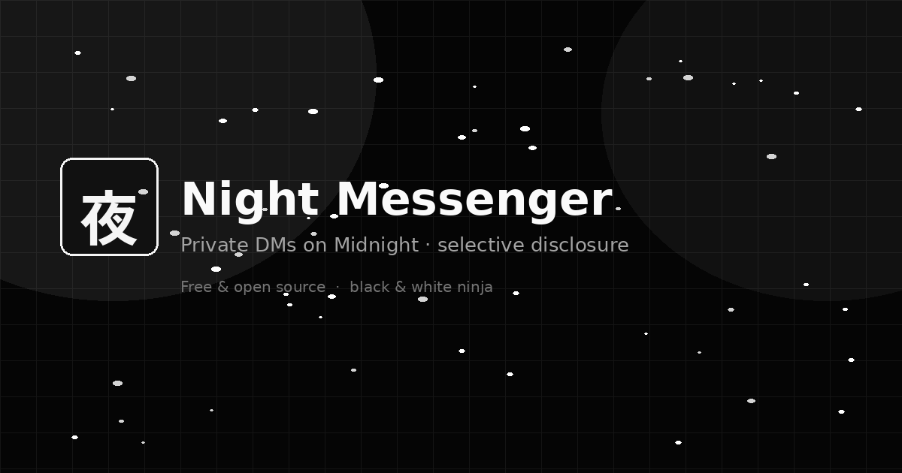
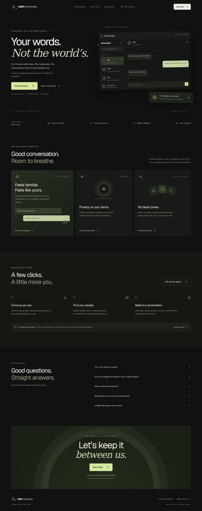
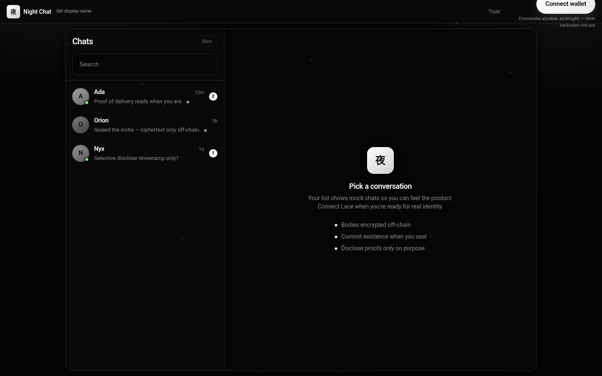
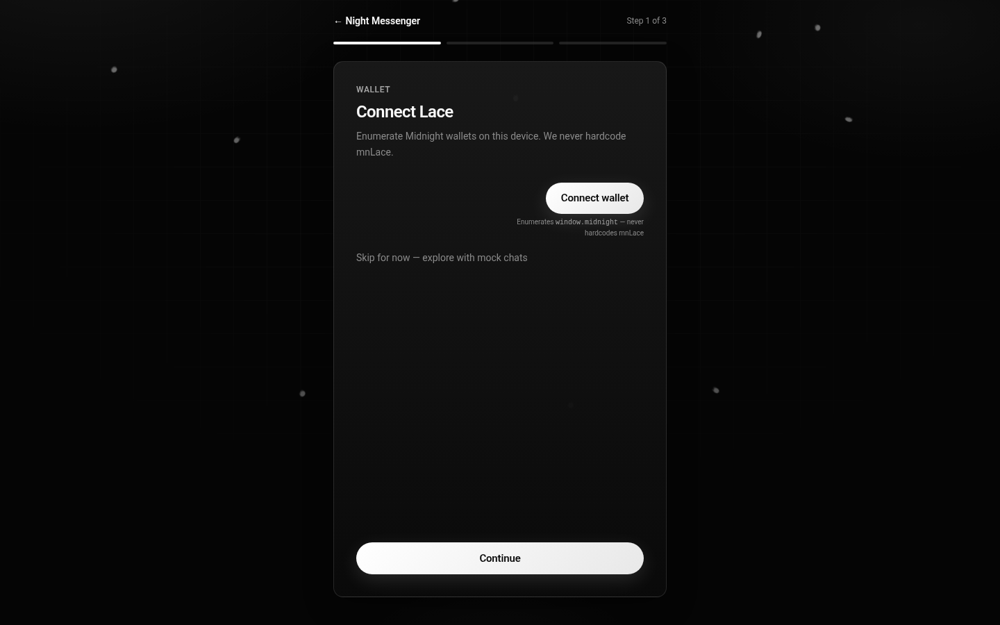
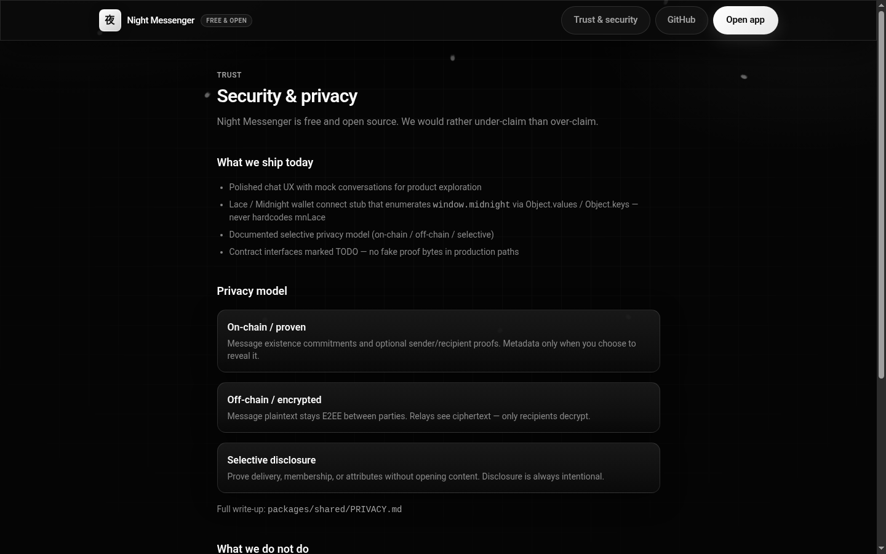
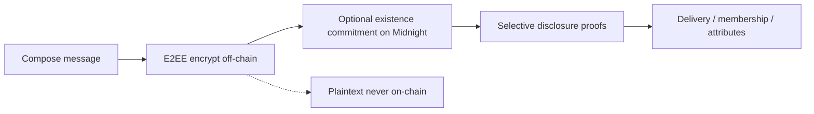
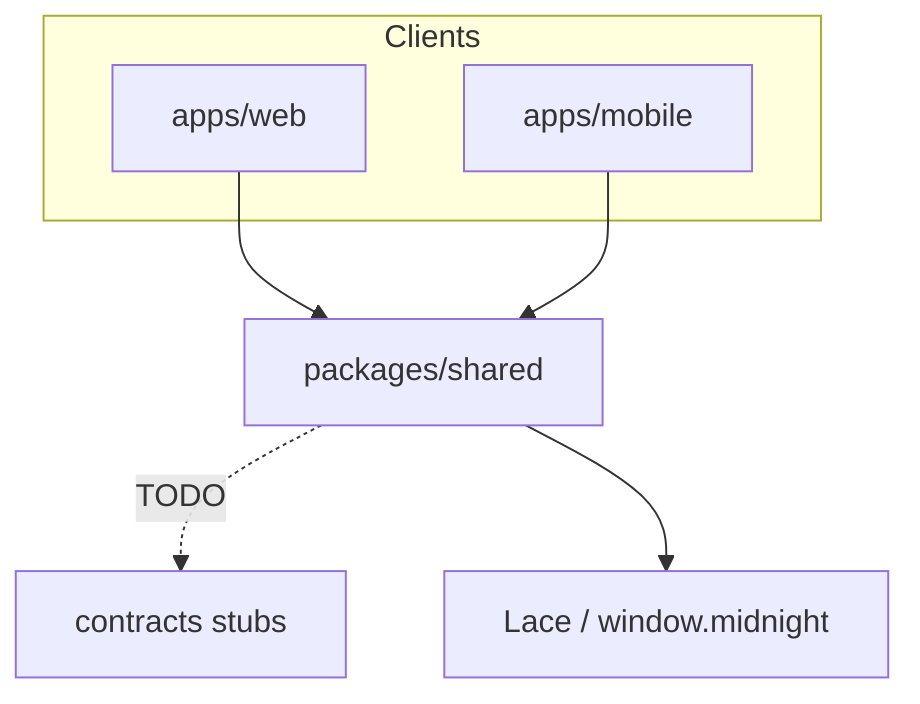

# Night Messenger

**Private messaging on Midnight — with selective disclosure.**

Free & open source. 1:1 DMs where plaintext stays encrypted, existence can be proven on-chain, and you choose what to disclose.

Repo: [github.com/Kshot3000/Night-Messenger-](https://github.com/Kshot3000/Night-Messenger-)



### Screenshots

| Landing | Chat |
| --- | --- |
|  |  |

| Onboarding | Trust |
| --- | --- |
|  |  |

## Product

| | |
| --- | --- |
| **Web** | Next.js App Router · Messenger-like chat shell · landing, onboarding, trust page |
| **Android** | Expo (React Native) · same visual language · Android-first `app.json` |
| **Privacy** | Documented in [`packages/shared/PRIVACY.md`](packages/shared/PRIVACY.md) |
| **Contracts** | Compact stubs in [`contracts/`](contracts/) — explicitly unimplemented |
| **Price** | Free forever · no paywalls |

### Selective privacy (summary)



| Layer | What | Who sees it |
| --- | --- | --- |
| On-chain / proven | Commitments, optional membership proofs, opted-in metadata | Verifiers with the proof |
| Off-chain / encrypted | Message plaintext | Recipients only |
| Selective | Delivery / membership / attribute proofs without content | Parties you choose |

## Monorepo layout

```
/apps/web          — Next.js + Tailwind (priority)
/apps/mobile       — Expo React Native (Android-first)
/packages/shared   — types, privacy docs, wallet helper, API stubs
/contracts         — selective DM Compact/TS stubs + README
```

## Prerequisites

- Node.js ≥ 20
- pnpm 9.x (`corepack enable` or `npm i -g pnpm@9`)
- For Android: Expo Go or Android Studio emulator

## Install

```bash
cd Night-Messenger-   # or midnight-messenger locally
pnpm install
```

## Run web

```bash
pnpm --filter @midnight-messenger/web dev
# → http://localhost:3000
```

- `/` — landing (sells selective privacy)
- `/onboarding` — wallet → display name → privacy lesson
- `/app` — chat shell (mock conversations if wallet not connected)
- `/security` — trust & security

**Wallet:** Connect enumerates `Object.values(window.midnight)` / `Object.keys` — never hardcodes `mnLace`.

## Run Android

```bash
pnpm --filter @midnight-messenger/mobile start
# then press `a` for Android, or scan QR with Expo Go
```

## Architecture



## Stubbed vs real

| Piece | Status |
| --- | --- |
| Chat UI (web + Android) | **Real** mock UX |
| Landing / onboarding / trust | **Real** product pages |
| Wallet discovery helper | **Real** enumeration pattern; connect needs Lace installed |
| Message transport / E2EE | **Stub** — local mock API |
| Compact circuits / proofs | **Stub** — TODO interfaces only |
| Groups / reactions / media | **Not in MVP** (media button stubbed) |

## Suggested next steps

1. Wire `@midnight-ntwrk/dapp-connector-api` and live Lace connect on preprod
2. Implement Compact `commitMessage` / `proveDelivery` from `contracts/`
3. E2EE key agreement + encrypted relay
4. Android Lace deep-link when platform support is ready
5. Groups & media after 1:1 is solid

## License

MIT (or as declared when published). Built for the Midnight ecosystem by Kshot ([@kshot9000](https://x.com/kshot9000) / [Kshot3000](https://github.com/Kshot3000)).
